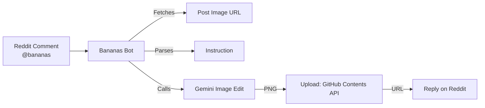
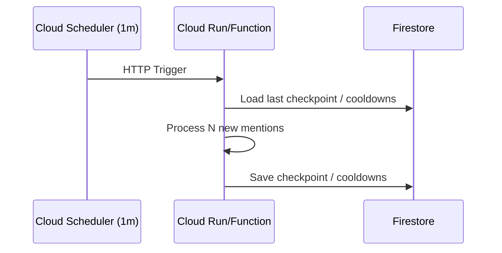

<div align="center">

# 🍌 Bananas — Reddit Image Alchemist

Turn any Reddit image into anything you can imagine by just mentioning `@bananas` (or `u/bananas`) with a plain‑English instruction. Fast. Serverless‑ready. Community‑friendly.

<br/>


<br/>

<i>“Say the word. The image obeys.”</i>

</div>

---

## ✨ What It Does

- Mention `@bananas` anywhere under an image post and add an instruction.
- The bot fetches the post’s image, applies your instruction with Gemini, and replies with a fresh PNG.
- Images are hosted for permanence via GitHub (or plug in another storage).

Examples:

```
"@bananas make it vaporwave"
"u/bananas remove the background"
"@bananas turn this into a watercolor painting"
```

---

## 🧭 Why This Repo Exists

- 24/7 bot experience without paying for always‑on servers
- Configurable rate limits and allowlists to keep things civil
- One‑click deploy path so others can run their own copy with their own key

---

## 🏗️ Architecture (at a glance)



Optional serverless fit (recommended):



---

## 🚀 Quick Start (Local)

1) Create `.env` in the project root:

```
REDDIT_CLIENT_ID=...
REDDIT_CLIENT_SECRET=...
REDDIT_USER_AGENT=bananas-bot/1.0 by YOUR_USERNAME
REDDIT_USERNAME=...
REDDIT_PASSWORD=...

SUBREDDITS=test
MAX_CALLS_PER_HOUR=10
USER_COOLDOWN_SECONDS=120
RATE_LIMIT_MODE=skip

GEMINI_API_KEY=...
GITHUB_TOKEN=...
GITHUB_REPO=YOUR_NAME/your-images-repo
GITHUB_BRANCH=main
```

2) Install deps and run:

```
python -m venv .venv && source .venv/bin/activate
pip install -r requirements.txt
python main.py
```

---

## 🛡️ Safety & Guardrails

- Per‑user cooldowns and an hourly global cap
- Optional allowlist (`ALLOWED_USERS`) to restrict who can trigger
- Hard size limits and content checks on downloads
- Errors are logged; the bot retries safely without flooding

---

## 🧩 Environment Variables

- `REDDIT_CLIENT_ID`, `REDDIT_CLIENT_SECRET`, `REDDIT_USER_AGENT`, `REDDIT_USERNAME`, `REDDIT_PASSWORD`
- `SUBREDDITS` (e.g. `test+pics+funny`), `MAX_CALLS_PER_HOUR`, `USER_COOLDOWN_SECONDS`, `RATE_LIMIT_MODE`, `RATE_LIMIT_MESSAGE`
- `ALLOWED_USERS` (comma‑separated usernames; optional)
- `GEMINI_API_KEY`
- `GITHUB_TOKEN`, `GITHUB_REPO` (e.g. `owner/repo`), `GITHUB_BRANCH`

---

## ☁️ Deploy (Community‑Ready)

Add a “Deploy to Cloud Run” button to your fork for one‑click setups:

```
[](https://deploy.cloud.run/?git_repo=https://github.com/YOUR_NAME/YOUR_REPO)
```

Tip: Encourage users to deploy their own copy with their own `GEMINI_API_KEY` to distribute usage fairly.

---

## 🧪 Tips for Great Results

- Be explicit: “convert to watercolor” > “make it cool”
- Prefer a single, clear instruction
- If nothing is provided, the bot defaults to grayscale

---

## 🛠️ Roadmap

- Cloud Run/Functions + Scheduler polling mode
- Firestore for cooldowns/checkpoints
- Key health monitoring and dashboard
- Pluggable storage backends (GCS, R2, S3)

---

## 🤝 Contributing

Issues and PRs welcome. Please remove any secrets from logs and avoid sharing `.env` content in issues.

---

<div align="center">

Made with 🍌 — happy hacking!

</div>

